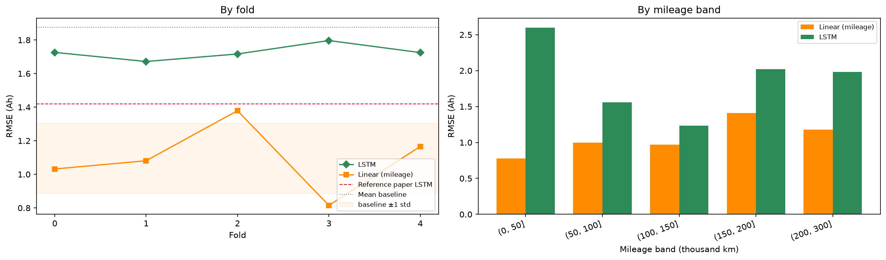

# EV Battery Capacity Prediction

Estimating electric-vehicle battery capacity from ordinary charging behaviour, with a full
production MLOps pipeline.

**[Live API](https://ev-battery-api.purplepond-b6a72396.eastus.azurecontainerapps.io/docs)** ·
**[Experiment tracking](https://dagshub.com/RutikaKadam10/ev-battery-capacity-prediction.mlflow)**

> The deployment runs on Azure free credit, which expires 3 October 2026. Screenshots in
> `docs/screenshots/` show the service running. The API scales to zero when idle, so the first
> request after a quiet period takes 10–30 seconds to wake.

---

## The problem

Battery capacity is the clearest measure of an EV battery's health, but it is expensive to
observe. Measuring it requires a charging session to pass through a specific voltage window
(3.77 V → 4.05 V) at a steady current, then integrating the charge that flows in.

Real drivers rarely cooperate. They plug in at 60% charge, unplug early, or use whatever current
the station provides. **In this dataset, 44% of charging sessions (279,380 of 629,121) carry no
usable capacity measurement for exactly that reason.**

But charging *behaviour* is recorded on every session regardless: how voltage rises, how
individual cells drift apart, how the pack heats. That behaviour reflects the battery's condition
whether or not the measurement protocol was satisfied.

### The research question

> **Can charging behaviour alone — with no odometer reading — recover what mileage tells us for
> free?**

This was not the starting point. It emerged from the EDA, where a single-feature linear regression
on mileage was found to outperform the published deep-learning benchmark. Once that was
established, "which architecture gets a lower RMSE" was no longer an honest question to ask.

**Why the distinction matters operationally.** Mileage tells you a battery is *statistically*
likely to be worn. Charging behaviour tells you what *this specific* battery's state is. At
150,000 km the per-vehicle spread in capacity is 1.33 Ah — two vehicles with identical odometer
readings can genuinely sit at 37 Ah and 40 Ah. A fleet operator does not need *"vehicles at 150k km
average 38.7 Ah"*; they need *"vehicle 47 needs attention now"*.

---

## Results

All figures out-of-sample, 5-fold cross-validation split at the vehicle level.

| Model | Inputs | RMSE (Ah) | R² |
|---|---|---|---|
| Mean baseline | none | 1.877 | −0.052 |
| **Linear regression** | **mileage only** | **1.095 ± 0.21** | **0.635** |
| LSTM | 128×9 charging window | 1.690 ± 0.076 | 0.143 |
| Transformer | 128×9 charging window | 1.710 ± 0.091 | 0.122 |
| *Reference paper's LSTM* | *128×8 charging window* | *1.420* | *—* |

**A single-feature linear model on the odometer beats the published deep-learning result by 21%**,
on RMSE, MAE and MAPE alike. Neither the reference paper nor the dataset authors' implementation
reports such a baseline.

### Findings

**1. The sequence models extract real but weak signal.** Correlation of 0.40 between predicted and
actual, reaching R² 0.25 on individual folds. The improvement over the mean baseline is 3.3× the
fold-to-fold standard deviation, so it is a claimable result rather than noise.

**2. Mileage provides roughly four times more, for free.** It explains 63% of capacity variance;
charging behaviour explains 14%. The gap is 9× the LSTM's fold-to-fold spread — not something a
different fold assignment could reverse.

**3. LSTM and Transformer are indistinguishable.** The gap between them is 0.02 RMSE against a
significance threshold of 0.09, set before either was run. Across two independent runs the nominal
winner flipped.

**4. The Transformer is not using temporal order.** Removing positional encoding did not hurt
performance. Self-attention without it is permutation-invariant, so the model is treating the
window as an unordered bag of 128 readings.

**5. The limiting factor is the observation window, not the architecture.** Each snippet covers
~21 minutes, during which voltage moves ~0.04 V. The official capacity measurement integrates
across a 0.28 V swing — roughly 8× wider. Three independent results point the same way.

**6. The two approaches are complementary, not redundant.** Fold 3 is the mileage baseline's best
fold and both sequence models' worst; fold 4 is close to the reverse. The rankings are nearly
inverted across two independent runs, so the models are using different information. **A hybrid
using both should outperform either** — the strongest candidate for future work.



---

## Data

**EVBattery** — He, Wang, Sun et al. (2023), *Real-World Electric Vehicle Battery Dataset*,
NeurIPS Datasets & Benchmarks Track. CC-BY-NC-SA. Real charging telemetry from a production EV
fleet.

| | |
|---|---|
| Vehicles | 30 (stratified subset of 100) |
| Snippets | 111,276 |
| Snippet shape | 128 timesteps × 9 channels (~21 min of charging) |
| Target | Capacity in Ah, 26.64 – 45.35 (mean 40.49, std 1.86) |
| Folds | 5, split by vehicle |

**Channels:** average cell voltage, charging current, SOC, max/min cell voltage, max/min cell
temperature, plus two engineered — **cell voltage spread** and **temperature spread**. As a pack
ages its cells drift apart in voltage, so those differences are recognised degradation indicators.
Supplying them directly raised correlation from 0.282 to 0.342.

The raw timestamp channel was dropped: it runs 0 → 1270 s identically in every snippet, so it
carries no information distinguishing one from another.

### Methodology

**Split by vehicle, never by snippet.** Roughly 10 overlapping snippets come from each charging
session, and each vehicle traces a distinctive degradation curve. A random snippet-level split
would leak both ways. A test asserts no vehicle appears on both sides of any boundary, and it runs
in CI.

**Mileage is withheld from the sequence models.** They see only the charging window. Supplying the
odometer would let them shortcut to "old vehicle → low capacity" without learning anything from
charging behaviour.

**Normalisation fitted on the training split only**, and saved inside every checkpoint so the API
normalises exactly as training did.

**A significance threshold fixed in advance.** With a fold-to-fold std of 0.045, any difference
below 0.09 RMSE cannot be claimed. Set before the Transformer was run, and applied mechanically.

---

## Architecture

```
data (DVC)  ->  cache  ->  train  ->  checkpoint  ->  Docker image  ->  Azure Container Apps
 Azure Blob            MLflow tracking                    ACR            public HTTPS URL
 + Dagshub               (Dagshub)
```

| Stage | Tool |
|---|---|
| Data versioning | DVC — Azure Blob (primary), Dagshub (backup) |
| Pipeline | `dvc.yaml`: cache → train_lstm, train_transformer |
| Experiment tracking | MLflow on Dagshub |
| Serving | FastAPI |
| Containerisation | Docker, separate training and serving images |
| CI/CD | GitHub Actions — lint, 43 tests, image build |
| Registry | Azure Container Registry |
| Deployment | Azure Container Apps |

**Reproducibility.** Every MLflow run records the git commit *and* the DVC data hash, so any result
traces back to both the code and the data that produced it. Seeded per fold, a full rebuild from
raw data reproduced both models to four decimal places.

**Monitoring** is designed but not built. The API exposes a Prometheus-format `/metrics` endpoint,
so adding Grafana would be configuration rather than code.

---

## API

`POST /predict` takes one 128×9 charging snippet and returns capacity in Ah plus State of Health.

```bash
curl -X POST https://ev-battery-api.purplepond-b6a72396.eastus.azurecontainerapps.io/predict \
  -H "Content-Type: application/json" \
  -d '{"snippet": [[4.09, -14.3, 88.2, 4.09, 4.07, 14, 10, 0.02, 4], ...]}'
```

```json
{"capacity_ah": 38.471, "soh_percent": 83.32, "model_name": "lstm", "fold": 0}
```

| Endpoint | Purpose |
|---|---|
| `POST /predict` | One snippet → capacity |
| `POST /predict/batch` | Up to 1000 snippets — fleet scoring |
| `GET /health` | Liveness probe |
| `GET /model/info` | Model, fold, input shape, channels, test metrics |
| `GET /metrics` | Prometheus format |
| `GET /docs` | Interactive documentation |

`/model/info` reports the served model's own test metrics, read from the checkpoint — so a caller
can judge how much to trust a prediction without asking.


---

## Reproducing

```bash
git clone https://github.com/RutikaKadam10/ev-battery-capacity-prediction.git
cd ev-battery-capacity-prediction

uv venv && source .venv/bin/activate
uv pip install -r requirements.txt

dvc pull -r dagshub     # data and trained models
dvc repro               # rebuild only what changed
```

```bash
python -m pytest tests/ -v                          # 43 tests
uvicorn src.api:app --reload --port 8001            # API at /docs
docker build -f Dockerfile.serve -t ev-battery-serve .
```

Run the pipeline end to end:

```bash
python -m src.data                                  # build cache, verify splits
python -m src.train --model lstm --all-folds
python -m src.train --model transformer --all-folds
```

All hyperparameters live in `params.yaml`. Changing one and running `dvc repro` retrains only the
affected model.

---

## Repository

```
params.yaml                 all hyperparameters and paths
dvc.yaml / dvc.lock         pipeline definition
src/
  config.py                 params, paths, device
  data.py                   cache, splits, scaler, Dataset
  models.py                 LSTMNet, TransformerNet
  evaluate.py               metrics, per-band breakdown
  train.py                  training loop, checkpoints, MLflow
  predict.py                inference
  api.py                    FastAPI service
tests/                      43 tests, no dataset required
notebooks/                  01-05, exploration and results record
docs/                       method, results and setup notes
reports/                    metrics, per-fold and per-band CSVs, figures
Dockerfile.serve            ~1 GB, FastAPI + model
Dockerfile.train            full stack, mounts data
.github/workflows/          ci.yml, build.yml
```

### Documentation

| File | Contents |
|---|---|
| `docs/EDA_FINDINGS.md` | Data exploration and findings |
| `docs/LSTM_METHOD.md` | LSTM design decisions and ablations |
| `docs/LSTM_RESULTS.md` | Full LSTM results |
| `docs/TRANSFORMER_METHOD.md` | Transformer design, positional-encoding test |
| `docs/MLFLOW_DAGSHUB_NOTES.md` | Experiment-tracking setup |
| `docs/MLOPS_PLAN.md` | Infrastructure plan and rationale |

---

## Limitations

- **30 of 100 vehicles**, single manufacturer. The reference paper used the full fleet, so its
  1.420 is not directly comparable.
- **Sequence models train on 18 vehicles per fold** against the baselines' 24, because 6 are
  reserved for validation. The baselines need none.
- **The deployed model is fold 0's checkpoint**, trained on 18 vehicles. In production you would
  retrain on all data once cross-validation has confirmed the configuration — CV estimates
  performance, the shipped model uses everything. A fold model was kept because it has a measured
  test score attached.
- **Thin distribution tails.** Half of all snippets fall within a 2.42 Ah window, and the 27–28 Ah
  cluster is separated from the main distribution by a ~6 Ah gap with almost no data. No model can
  interpolate into a region it has never seen.
- **Sparse high-mileage data.** Only 4.1% of snippets come from above 200,000 km — the region where
  charging behaviour should most outperform the odometer. A negative result there is confounded
  with data scarcity.
- **Single tuning pass**, selected on fold 0 validation rather than a systematic search.

## Future work

**A hybrid model** combining charging behaviour with mileage. The inverted per-fold rankings across
two independent runs indicate the two sources are complementary.

**Wider observation windows.** Concatenating snippets from the same charging session (available via
`charge_segment`) would span a much larger voltage range — closer to what the official measurement
requires, and the change most likely to move the result.

**Cross-brand generalisation.** Train on one manufacturer, test on another. Neither reference work
addresses it, and no fleet operator runs a single brand.

---

## References

1. He, Wang, Sun et al. (2023). *Real-World Electric Vehicle Battery Dataset*. NeurIPS Datasets &
   Benchmarks Track.
2. van den Hoven & Ranković (2026). *Data-Driven Battery Capacity Estimation in Electric Vehicles:
   Insights from Large-Scale Real-World Data*. Energy Systems.
   <https://link.springer.com/article/10.1007/s12667-025-00775-y>
